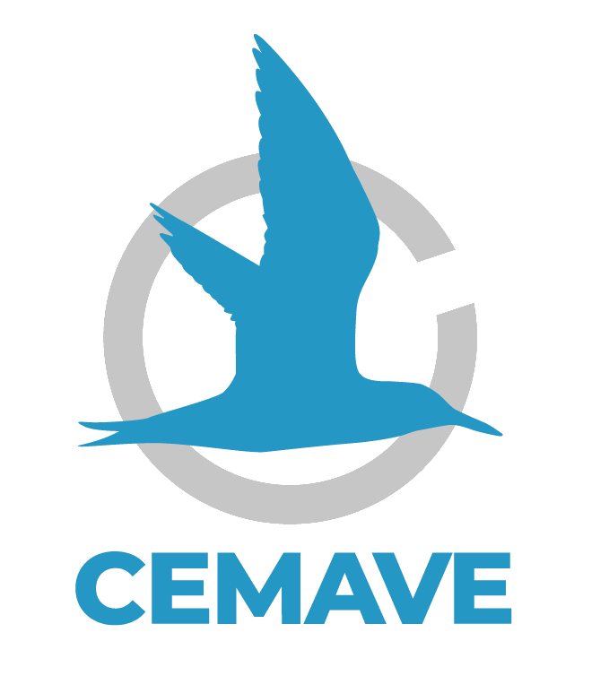
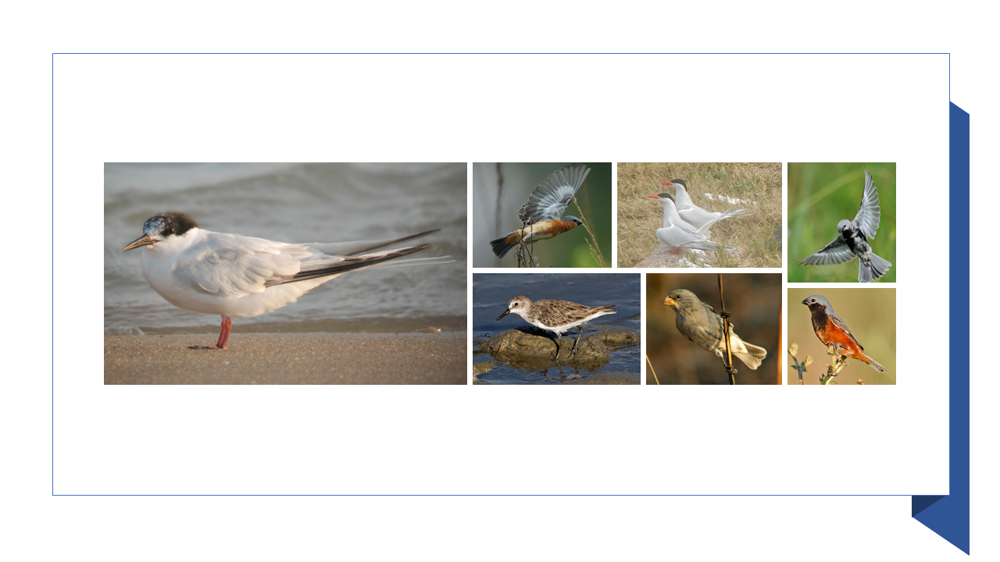
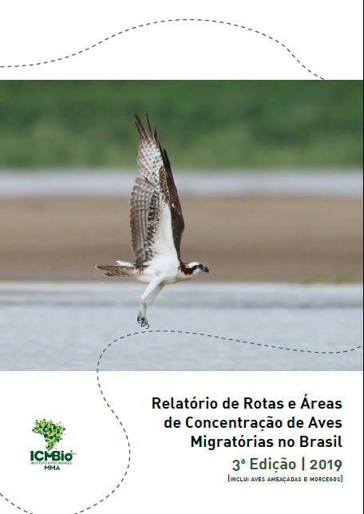

```{r setup, include=FALSE}
library(flexdashboard)
```

```{r libraries, warning = FALSE, message = FALSE}

library(tidyverse)
library(data.table)
library(descr)
library(RColorBrewer)
library(hrbrthemes)
library(kableExtra)
library(janitor)
library(skimr)
library(knitr)
library(htmltools)
library(htmlwidgets)
library(DT)
library(leaflet)
library(sf)
library(shiny)
library(plotly)
library(ggthemes)
library(forcats)
library(crosstalk)
library(summarywidget)
library(rgdal)
library(foreign)
library(ggpubr)
library(sp)
library(stringi)
library(readxl)
options(knitr.table.format = "html")
```

Visão Geral
=================

Input {.sidebar}
-----------------------------------------------------------------------

### 


</br>


```{r , echo=FALSE, fig.cap=" ", out.width = '80%', fig.align='center'}



```

</br>


```{r , echo=FALSE, fig.cap=" ", out.width = '70%', fig.align='center'}


```


</br>


```{r , echo=FALSE, fig.cap=" ", out.width = '70%', fig.align='center'}


```


</br>
</br>
</br>

<center>

Dúvidas e sugestões:
cemave.sede@icmbio.gov.br

</center>

Column {data-width=800}
-----------------------------------------------------------------------

### **Áreas Importantes para Aves Migratórias**

```{r leitura e pré-processamento de dados, include = FALSE}

# Leitura de bases de dados

#ameacadas <- read.csv2("data/ameacadas.csv")
ameacadas <- read_xlsx("data/ameacadas.xlsx")

#areas_importantes <-  readOGR("data/AI/AI_riqueza_X_AI_concentracao.shp", verbose = FALSE)
riqueza <-  readOGR("data/Riqueza/AI_riqueza.shp", verbose = FALSE)
concentracao <-  readOGR("data/AC/AI_concentracao.shp", verbose = FALSE)
#ucf_integral <-  readOGR("data/UC/UC_fed_junho_2020_PI.shp", verbose = FALSE)
#ucf_sustentavel <-  readOGR("data/UC/UC_fed_junho_2020_US.shp", verbose = FALSE)
spp_ameacadas <- readOGR("data/Ameacadas/Area_ameacadas.shp", verbose = FALSE)
#TI_homologadas <-  readOGR("data/TI_homo/ti_sirgas.shp", verbose = FALSE)
#iba <-  readOGR("data/IBA/IBAs_final.shp", verbose = FALSE)
#aerogeradores <-  readOGR("data/PE/Aerogeradores.shp", verbose = FALSE)

# ----------------------------

# Ajustes de acentuação

# Encoding(aerogeradores$NOME_EOL) <- "UTF-8"
# Encoding(aerogeradores$PROPRIETAR) <- "UTF-8"
# Encoding(aerogeradores$OPERACAO) <- "UTF-8"

# Encoding(ucf_integral$nome) <- "UTF-8"
# Encoding(ucf_integral$municipios) <- "UTF-8"
# Encoding(ucf_integral$biomaIBGE) <- "UTF-8"
# Encoding(ucf_sustentavel$nome) <- "UTF-8"
# Encoding(ucf_sustentavel$municipios) <- "UTF-8"
# Encoding(ucf_sustentavel$biomaIBGE) <- "UTF-8"

# ----------------------------

# area_conc = tabela com os dados dos nomes corretos das áreas, descrições, estados e fontes

areas_conc <- read.table("data/concentracao.csv", header = T, sep = ";", encoding = "UTF-8")

# mudando o nome da coluna das áreas para "Local"

areas_conc <- rename(areas_conc, Local = X.U.FEFF.Local)

N_concentracao <- concentracao

# Operação de substituição de nomes abaixo realizada para cada um dos registros

N_concentracao$Nome[N_concentracao$Nome == "Foz do Rio dos Touros - Tropeira 3 Rio dos Touros passo santa vittria"] <- "Foz do rio dos Touros"
N_concentracao$Nome[N_concentracao$Nome == "Coxilha Rica - Tropeira 1. Lages . S o Joaquim"] <- "Coxilha Rica"
N_concentracao$Nome[N_concentracao$Nome == "Coxilha Rica- Tropeira 1. Lages . S o Joaquim"] <- "Coxilha Rica"
N_concentracao$Nome[N_concentracao$Nome == "Reserva da Capitulina - Tropeira 2 Capitulina Vacaria"] <- "Reserva da Capitulina"
N_concentracao$Nome[N_concentracao$Nome == "Ninhos Vacaria - Area Reprod beltoni"] <- "Ninhos/Vacaria"
N_concentracao$Nome[N_concentracao$Nome == "Urupema"] <- "Município de Urupema"
N_concentracao$Nome[N_concentracao$Nome == "Ilhas_Maratizes"] <- "Ilhas dos municípios de Vila Velha, Guarapari, Itapemirim e Marataízes"
N_concentracao$Nome[N_concentracao$Nome == "Ilhas_Itapemirim"] <- "Ilhas dos municípios de Vila Velha, Guarapari, Itapemirim e Marataízes"
N_concentracao$Nome[N_concentracao$Nome == "Ilhas_de_Guarapari"] <- "Ilhas dos municípios de Vila Velha, Guarapari, Itapemirim e Marataízes"
N_concentracao$Nome[N_concentracao$Nome == "Ilhas_de_Vila_Velha"] <- "Ilhas dos municípios de Vila Velha, Guarapari, Itapemirim e Marataízes"
N_concentracao$Nome[N_concentracao$Nome == "ESTAÇÃO ECOLÓGICA DO TAIM"] <- "Estação Ecológica (ESEC) do Taim"
N_concentracao$Nome[N_concentracao$Nome == "Banhados e Cordoes Litoraneos RS"] <- "Região dos Banhados e Cordões Litorâneos"
N_concentracao$Nome[N_concentracao$Nome == "REBIO Mato Grande"] <- "Reserva Biológica (REBIO) do Mato Grande e a várzea do Canal de São Gonçalo"
N_concentracao$Nome[N_concentracao$Nome == "Varzea do Canal Sao Goncalo"] <- "Reserva Biológica (REBIO) do Mato Grande e a várzea do Canal de São Gonçalo"
N_concentracao$Nome[N_concentracao$Nome == "Estuario Laguna dos Patos"] <- "Estuário da Laguna dos Patos"
N_concentracao$Nome[N_concentracao$Nome == "RS_Litoral_Medio"] <- "Litoral Médio"
N_concentracao$Nome[N_concentracao$Nome == "Campo da Regiao de Bage"] <- "Campos da Região de Bagé"
N_concentracao$Nome[N_concentracao$Nome == "PARQUE NACIONAL DA LAGOA DO PEIXE"] <- "Parque Nacional da Lagoa do Peixe"
N_concentracao$Nome[N_concentracao$Nome == "Ilha do Cajual MA"] <- "Reentrâncias Maranhenses"
N_concentracao$Nome[N_concentracao$Nome == "Reentrancias Maranhenses/Paraenses"] <- "Reentrâncias Maranhenses"
N_concentracao$Nome[N_concentracao$Nome == "Ilha Grande CE"] <- "Ilha Grande"
N_concentracao$Nome[N_concentracao$Nome == "RESERVA DE DESENVOLVIMENTO SUSTENAVEL MAMIRAUA"] <- "Reserva de Desenvolvimento Sustentável Mamirauá"
N_concentracao$Nome[N_concentracao$Nome == "Fernando de Noronha"] <- "Arquipélago de Fernando de Noronha"
N_concentracao$Nome[N_concentracao$Nome == "Rebio do Atol das RocasRebio do Atol das Rocas"] <- "Atol das Rocas"
N_concentracao$Nome[N_concentracao$Nome == "RESERVA EXTRATIVISTA CATUA-IPIXUNA"] <- "Reserva Extrativista Catuá-Ipixuna"
N_concentracao$Nome[N_concentracao$Nome == "Complexo Litoraneo da Bacia Potiguar"] <- "Complexo Litorâneo da Bacia Potiguar"
N_concentracao$Nome[N_concentracao$Nome == "RESERVA DE DESENVOLVIMENTO SUSTENTAVE PIAGUCU-PURUS"] <- "Reserva de Desenvolvimento Sustentável Piagaçu-Purus"
N_concentracao$Nome[N_concentracao$Nome == "Coroa do Aviao"] <- "Ilha da Coroa do Avião"
N_concentracao$Nome[N_concentracao$Nome == "P.E. do Cantao"] <- "Parque Estadual do Cantão"
N_concentracao$Nome[N_concentracao$Nome == "A.P.A. Ilha do Bananal/Cantao"] <- "APA da Ilha do Bananal"
N_concentracao$Nome[N_concentracao$Nome == "APA de Piabucu"] <- "Área de Proteção Ambiental (APA) de Piaçabuçu"
N_concentracao$Nome[N_concentracao$Nome == "Estuario do Rio Sergipe"] <- "Estuário do rio Sergipe"
N_concentracao$Nome[N_concentracao$Nome == "Complexo de estuarios Sergipe"] <- "Complexo do estuário dos rios Piauí, Fundo e Real"
N_concentracao$Nome[N_concentracao$Nome == "Cacha Pregos"] <- "Região de Cacha-Prego"
N_concentracao$Nome[N_concentracao$Nome == "Parque Nacional da Chapada dos Guimaraes e Adjacencias"] <- "Chapada dos Guimarães"
N_concentracao$Nome[N_concentracao$Nome == "RPPN SESC Pantanal e Entorno"] <- "RPPN Sesc Pantanal"
N_concentracao$Nome[N_concentracao$Nome == "Parna Marinho dos Abrolhos"] <- "Arquipélago de Abrolhos"
N_concentracao$Nome[N_concentracao$Nome == "Nhecolandia_Paiaguas"] <- "Região de Nhecolândia e Paiaguás"
N_concentracao$Nome[N_concentracao$Nome == "Trindade e Martin-Vaz"] <- "Ilhas de Trindade e Martim Vaz"
N_concentracao$Nome[N_concentracao$Nome == "Quissamã"] <- "Região do município de Quissamã, incluindo o PARNA da Restinga de Jurubatiba"
N_concentracao$Nome[N_concentracao$Nome == "PARQUE NACIONAL DA RESTINGA DE JURUBATIBA"] <- "Região do município de Quissamã, incluindo o PARNA da Restinga de Jurubatiba"
N_concentracao$Nome[N_concentracao$Nome == "Reservatorio de Guarapiranga"] <- "Bacia hidrográfica do reservatório Guarapiranga"
N_concentracao$Nome[N_concentracao$Nome == "Ilhabela SP"] <- "Ilha Bela"
N_concentracao$Nome[N_concentracao$Nome == "Alcatrazes SP"] <- "Arquipélago de Alcatrazes"
N_concentracao$Nome[N_concentracao$Nome == "Laje de Conceicao_SP"] <- "Laje da Conceição"
N_concentracao$Nome[N_concentracao$Nome == "Laje de Santos SP"] <- "Laje de Santos"
N_concentracao$Nome[N_concentracao$Nome == "Campos Gerais PR"] <- "Região dos Campos Gerais"
N_concentracao$Nome[N_concentracao$Nome == "Ilha do Castilho"] <- "Castilho"
N_concentracao$Nome[N_concentracao$Nome == "Ilha da Figueira PR"] <- "Ilha da Figueira"
N_concentracao$Nome[N_concentracao$Nome == "PM de Barigui"] <- "Parque Municipal de Barigui"
N_concentracao$Nome[N_concentracao$Nome == "Ilha dos Currais PR"] <- "Parque Nacional da Ilha dos Currais e Ilhas da Figueira e Itacolomi"
N_concentracao$Nome[N_concentracao$Nome == "Ilhas Itacolomis"] <- "Parque Nacional da Ilha dos Currais e Ilhas da Figueira e Itacolomi"
N_concentracao$Nome[N_concentracao$Nome == "Agua Doce Santa Catarina"] <- "Região dos Campos de Água Doce"
N_concentracao$Nome[N_concentracao$Nome == "Ilha Deserta SC"] <- "Ilhas marinhas costeiras da Deserta (REBIO Arvoredo), Moleques do Sul (Parque Estadual do Tabuleiro), Santana de Dentro e Santana de Fora (APA da Baleia Franca)"
N_concentracao$Nome[N_concentracao$Nome == "Ilhas Moleques do Sul"] <- "Ilhas marinhas costeiras da Deserta (REBIO Arvoredo), Moleques do Sul (Parque Estadual do Tabuleiro), Santana de Dentro e Santana de Fora (APA da Baleia Franca)"
N_concentracao$Nome[N_concentracao$Nome == "Ilha Santana de Dentro e Ilha Santana de Fora"] <- "Ilhas marinhas costeiras da Deserta (REBIO Arvoredo), Moleques do Sul (Parque Estadual do Tabuleiro), Santana de Dentro e Santana de Fora (APA da Baleia Franca)"
N_concentracao$Nome[N_concentracao$Nome == "Vacaria Santa Catarina"] <- "Região nordeste do Rio Grande do Sul"
N_concentracao$Nome[N_concentracao$Nome == "Sao Jose dos Ausentes Santa Catarina"] <- "Região nordeste do Rio Grande do Sul"
N_concentracao$Nome[N_concentracao$Nome == "Bom Jesus Santa Catarina"] <- "Região nordeste do Rio Grande do Sul"
N_concentracao$Nome[N_concentracao$Nome == "Lages Santa Catarina"] <- "Lages"
N_concentracao$Nome[N_concentracao$Nome == "Campos de Cima Santa  Catarina"] <- "Região dos Campos de Cima da Serra"
N_concentracao$Nome[N_concentracao$Nome == "Banhado Sao Donato"] <- "Banhado de São Donato"
N_concentracao$Nome[N_concentracao$Nome == "PE_Espinilho"] <- "Parque Estadual do Espinilho"
N_concentracao$Nome[N_concentracao$Nome == "APA do Ibirapuita"] <- "Área de Proteção Ambiental (APA) do Ibirapuitã"


# Excluindo as áreas "Reentrâncias Paraenses" e "Estuário do rio Vaza-Barris"

areas_conc_alterado <- areas_conc %>% 
  filter(Local != "Estuário do rio Vaza-Barris" & Local != "Reentrâncias Paraenses")
  
# Unindo o arquivo .shp com o arquivo com o arquivo com os dados das áreas de concentração

areas_conc_alterado <- rename(areas_conc_alterado, Nome = Local)

N_concentracao <- merge(N_concentracao, areas_conc_alterado, by.x='Nome', by.y='Nome')

```


```{r construção dos mapas}

mapa <- leaflet() %>%
  # Base groups
  setView(lng = -58, lat = -14,
          zoom = 4.0) %>%
  addProviderTiles(providers$Esri.WorldImagery, group = "Imagem ESRI") %>%
  addProviderTiles(providers$Stamen.TonerLite, group = "Stamen Toner Lite (default)") %>%
  addProviderTiles(providers$OpenStreetMap.Mapnik, group = "Open Street Map") %>%

  # Overlay groups
  # addPolygons(data = areas_importantes,
  #             color = "#96390e",
  #             weight = 1,
  #             group = "Área importante para aves") %>%
  addPolygons(data = riqueza,
              color = "#3c39db",
              weight = 1,
              group = "Riqueza de aves") %>%
addPolygons(data = N_concentracao,
            color = "#3c39db",
            weight = 1,
            group = "Área de concentração de aves",
            popup = paste("Área: ", N_concentracao$Nome, "<br>",
                          "UF: ", N_concentracao$estado, "<br>",
                          "Descrição: ", N_concentracao$Descricao, "<br>",
                          "Fonte(s): ", N_concentracao$Fontes, "<br>")) %>%
  addPolygons(data = spp_ameacadas,
                   color = "#EB0000",
                   weight = 1,
                   group = "Ocorrência de spp de aves ameaçadas") %>%
# addPolygons(data = ucf_integral,
#             color = "#fc7303",
#             weight = 1,
#             group = "UC federal de uso sustentável",
#             popup = paste("Nome: ", ucf_integral$nome, "<br>",
#                           "Ano de criação: ", ucf_integral$anoCriacao, "<br>",
#                           "Área (ha): ", ucf_integral$areaHa, "<br>",
#                           "UF: ", ucf_integral$UF, "<br>",
#                           "Municípios: ", ucf_integral$municipios, "<br>",
#                           "Bioma: ", ucf_integral$biomaIBGE, "<br>",
#                           "CNUC: ", ucf_integral$codigoCnuc, "<br>")) %>%
# addPolygons(data = ucf_sustentavel,
#             color = "#158c35",
#             weight = 1,
#             group = "UC federal de proteção integral",
#             popup = paste("Nome: ", ucf_sustentavel$nome, "<br>",
#                           "Ano de criação: ", ucf_sustentavel$anoCriacao, "<br>",
#                           "Área (ha): ", ucf_sustentavel$areaHa, "<br>",
#                           "UF: ", ucf_sustentavel$UF, "<br>",
#                           "Municípios: ", ucf_sustentavel$municipios, "<br>",
#                           "Bioma: ", ucf_sustentavel$biomaIBGE, "<br>",
#                           "CNUC: ", ucf_sustentavel$codigoCnuc, "<br>")) %>%
  # addPolygons(data = TI_homologadas,
  #             color = "#fc7303",
  #             weight = 1,
  #             group = "Terra indígena homologada",
  #             popup = paste("Terra Indígena: ",  TI_homologadas$terrai_nom)) %>%
  # addPolygons(data = iba,
  #             color = "#73193F",
  #             weight = 1,
  #             group = "IBA (Important Bird Area") %>%
  # addCircleMarkers(data = aerogeradores,
  #                color = "#DF35F0",
  #                radius = 3,
  #                weight = 1,
  #                group = "Empreendimento eólico",
  #                popup = paste("Nome: ", aerogeradores$NOME_EOL, "<br>",
  #                           "Empresa: ", aerogeradores$PROPRIETAR, "<br>",
  #                           "Em operação: ", aerogeradores$OPERACAO, "<br>",
  #                           "Altura total (m): ", aerogeradores$ALT_TOTAL, "<br>",
  #                           "UF: ", aerogeradores$UF, "<br>")) %>%

  # Layers Control
  addLayersControl(
    baseGroups = c("Open Street Map",
                   "Stamen Toner Lite",
                   "Imagem ESRI"),
    overlayGroups = c(#"Área importante para aves",
                      "Riqueza de aves",
                      "Área de concentração de aves",
                      "Ocorrência de spp de aves ameaçadas"
                      #"UC federal de uso sustentável",
                      #"UC federal de proteção integral"
                      #"Terra indígena homologada",
                      #"IBA (Important Bird Area)",
                      #"Empreendimento eólico"
                      ),
        options = layersControlOptions(collapsed = TRUE, autoZIndex = TRUE))

mapa 

#mapa %>% hideGroup(c(#"Riqueza de aves",
                      #"Áreas de concentração de aves",
                      #"Ocorrência de spp de aves ameaçadas",
                      #"UC federal de uso sustentável",
                      #"UC federal de proteção integral",
                      #"Terra indígena homologada",
                      #IBA (Important Bird Area)",
                      #"Empreendimento eólico"))

```


Column {data-width=200}
-----------------------------------------------------------------------

### Espécies de aves no Brasil

```{r}

valueBox(1.919, icon = "fa-crow")
```

### Espécies consideradas migratórias

```{r}

valueBox(198, icon = "fa-dove", color = "#F4A952")
```

### Táxons de aves ameaçados no Brasil

```{r}

valueBox(206, icon = "fa-kiwi-bird", color = "#F4A952")
```


### km^2^ priorizados como Áreas Importantes para aves migratórias no Brasil


```{r}


valueBox(346.262, icon = "fas fa-map", color = "#F4A952")
```

### Áreas de concentração classificadas como importantes para aves migratórias no Brasil, distribuídas em

```{r}

valueBox(75, icon = "fa fa-binoculars", color = "#F4A952")
```

### estados totalizando 

```{r}

valueBox(21, icon = "fa-object-group")
```


### km^2^ de superfície

```{r}

valueBox(194.249, icon = "fa-map")
```


Áreas de Concentração
=================

Column {data-width=500}
-----------------------------------------------------------------------

### **Áreas de Concentração de aves por estado**

```{r leitura e pré-processamento dos dados, include = FALSE}


estados_sf <- st_read("data/estados/estados_2010.shp", quiet = TRUE)

estados_sf <- rename(estados_sf, estado = sigla)

estados_sf$regiao_id[estados_sf$regiao_id == 1] <- "Sul"
estados_sf$regiao_id[estados_sf$regiao_id == 2] <- "Sudeste"
estados_sf$regiao_id[estados_sf$regiao_id == 3] <- "Norte"
estados_sf$regiao_id[estados_sf$regiao_id == 4] <- "Nordeste"
estados_sf$regiao_id[estados_sf$regiao_id == 5] <- "Centro-Oeste"

#glimpse(estados_sf)

#Unindo os arquivo .shp dos estados com o arquivo com os dados das áreas de concentração

#glimpse(areas_conc_alterado)

estados_completo <- estados_sf %>% 
  left_join(areas_conc_alterado, "estado")

estados_completo$estado

estados_completo$AC[1] <- 0
estados_completo$AC[15] <- 0
estados_completo$AC[18] <- 0
estados_completo$AC[21] <- 0
estados_completo$AC[26] <- 0
estados_completo$AC[29] <- 0
estados_completo$AC[25] <- 0
estados_completo$AC[37] <- 0
estados_completo$AC[38] <- 0

estados_completo$AC <- as.integer(estados_completo$AC)

```


```{r construção de mapa e gráfico de áreas de concentração de aves}

areas_estados <- estados_completo %>%
group_by(estado) %>%
  summarise(AC = n()) %>% 
  arrange((AC))


#View(areas_estados)

areas_estados$AC[1] = as.integer(0)
areas_estados$AC[3] = as.integer(0)
areas_estados$AC[4] = as.integer(0)
areas_estados$AC[5] = as.integer(0)
areas_estados$AC[7] = as.integer(0)
areas_estados$AC[8] = as.integer(0)
areas_estados$AC[9] = as.integer(0)
areas_estados$AC[11] = as.integer(0)
areas_estados$AC[12] = as.integer(0)

areas_estados_sem_zeros <- areas_estados %>% 
  subset(AC != 0)


areas_regiao <- estados_completo %>%
group_by(regiao_id) %>%
  summarise(AC = n()) %>% 
  arrange((AC))
     
#View(areas_regiao)


bins <- c(0, 2, 4, 6, 8, 10, 12, 14)
qpal = colorBin("Blues", areas_estados$AC, bins = bins)

labels <- sprintf(
  "<strong>%s</strong>",
  areas_estados$AC
) %>% lapply(htmltools::HTML)

mapa_conc_estados <- leaflet(areas_estados) %>%
  
  addPolygons(stroke = TRUE,
              opacity = 1.0,
              fillOpacity = 1.0,
              smoothFactor = 0.5,
              color = "white",
              fillColor = ~qpal(areas_estados$AC),
              weight = 1,
              label = labels,
              labelOptions = labelOptions(
                style = list("font-weight" = "normal",
                             padding = "3px 8px"),
                             textsize = "15px",
                             direction = "auto"),
              highlight = highlightOptions(weight = 1, 
                                 color = "grey",
                                 fillOpacity = 0.9,
                                 bringToFront = T)) 
# %>%
#    addLegend(values = ~areas_estados$AC,
#             pal = qpal,
#             position = "bottomleft",
#             title = "Nº Áreas de Concentração")

mapa_conc_estados

```


Column 2 {data-width=500}
-----------------------------------------------------------------------

### **Nº de áreas de concentração de aves por estado**

```{r gráficos concentração por estados}

G1 <- areas_estados_sem_zeros %>% 
  ggplot(aes(x = fct_reorder(estado, AC, .desc = T),  
             y = AC)) +
  geom_col(fill="#608ebd") +
  xlab(" ") +
  ylab(" ") +
  theme_minimal() +
  theme(
    panel.grid.minor.y = element_blank(),
    panel.grid.major.y = element_blank(),
    panel.grid.minor.x = element_blank(),
    panel.grid.major.x = element_blank()
    ) 

ggplotly(G1)


```


### **Nº de áreas de concentração de aves por região**

```{r, gráfico concentração por região}

G2 <- areas_regiao %>% 
  ggplot(aes(x = fct_reorder(regiao_id, AC, .desc = T),  
             y = AC)) +
  geom_col(fill="#08325c") +
  xlab(" ") +
  ylab(" ") +
  theme_minimal() +
  theme(
    panel.grid.minor.y = element_blank(),
    panel.grid.major.y = element_blank(),
    panel.grid.minor.x = element_blank(),
    panel.grid.major.x = element_blank(),
    ) 

ggplotly(G2)

```


Aves Ameaçadas
===============================

Column {data-width=500}
-----------------------------------------------------------------------

### **Distribuição das espécies de aves ameaçadas de extinção**


```{r mapa das espécies ameaçadas de extinção}

mapa_spp_ameacadas <- leaflet(estados_sf) %>%
   setView(lng = -58, lat = -14, zoom = 4.0) %>% 
   addProviderTiles(providers$OpenStreetMap.Mapnik, group = "Open Street Map") %>%
  addPolygons(data = spp_ameacadas,
                   color = "#EB0000",
                  weight = 1,
                  group = "Ocorrência de spp de aves ameaçadas")
              labelOptions = labelOptions(
                style = list("font-weight" = "normal",
                             padding = "3px 8px"),
                             textsize = "15px",
                             direction = "auto")
  # addLegend(values = ~areas_estados$AC,
  #           pal = qpal,
  #           title = "Áreas de concentração por estado")

mapa_spp_ameacadas

```

Column {data-width=500}
-----------------------------------------------------------------------

### **Percentual de áreas com registros priorizado pelo Zonation na solução final para as espécies migratórias não oceânicas (corte em 30%).**

</br>


```{r gráficos concentração por estados e por região}

tab_ameacadas <- datatable(ameacadas,
                           extensions="Scroller",
                           style="bootstrap",
                           class="stripe", 
                           width="80%",
                           rownames = T,
                           filter = "top",
                           options=list(deferRender=TRUE,
                                   pageLength = 25,
                                   scrollY=300))

tab_ameacadas


```


Aves Migratórias
=================

Column 1 {data-width=500, .tabset .tabset.fade}
-----------------------------------------------------------------------

### **Migração**

</br>

A migração é uma resposta das populações silvestres a uma condição sazonal de baixa disponibilidade de recurso para outra onde o recurso é farto. Para a maioria dos casos, o recurso envolvido é alimento ou área para nidificação (Cornell University 2014), mas a migração também pode estar relacionada à disponibilidade de água ou à diminuição de competição (Able 1999).  

</br>

Recentemente, Somenzari e colaboradores (2018) revisaram as ocorrências e padrões de deslocamento de aves potencialmente migratórias para o Brasil. Uma espécie foi classificada como migratória quando pelo menos parte de sua população realiza movimentos cíclicos e sazonais com alta fidelidade aos seus sítios de reprodução. Assim, das 1.919 espécies listadas para o país (Piacentini *et al.* 2015), 198 atenderam aos critérios do citado estudo, sendo que 64% destas foram consideradas migratórias e 36% parcialmente migratórias, quando uma parte da população permanece no mesmo local ou região durante todo o ano. É esperado que este quantitativo aumente à medida que novos estudos sejam feitos, em especial para as espécies continentais, e novos registros sejam obtidos, em especial para as espécies vagantes ou com informações discrepantes. 

</br>

Ainda de acordo com Somenzari e colaboradores (2018), pouco mais da metade das espécies migratórias com ocorrência para o Brasil se reproduzem no país. Aquelas que possuem seus sítios de reprodução em outros países nidificam na região circumpolar relacionada à América do Norte e Groenlândia (aves setentrionais), em áreas no sul da América do Sul e Antártida (meridionais) ou ainda a oeste, na região andina. Tais espécies podem ser divididas em um grupo chamado de visitantes de verão e outro de visitantes de inverno. Assim, a presença de espécies migratórias que não se reproduzem no Brasil se faz notar em todas as estações do ano. Na primavera e verão, o país recebe populações advindas do hemisfério norte e quando estas iniciam seu retorno, as espécies austrais iniciam seu deslocamento ao norte, invernando especialmente nos estados da região Sul e Sudeste. Mais de um terço das famílias de aves brasileiras possuem ao menos uma espécie com comportamento migratório e, ao contrário do senso comum, Tyrannidae, uma família de Passeriformes continentais, é a que possui o maior número de espécies migratórias no Brasil. De forma semelhante, as espécies migratórias habitam virtualmente todos os ecossistemas, sejam eles de matriz florestal ou campestre, lacustres, costeiros ou marinhos (Somenzari *et al.* 2018).

### **Rotas Migratórias**

</br>

**Principais rotas migratórias no Brasil**

</br>

Rotas de longa distância

1. **Rota Atlântica** – ao longo de toda costa brasileira, do Amapá até o Rio Grande do Sul;
2. **Rota Nordeste** – consiste numa divisão da Rota Atlântica, iniciando na Baía de Sao Marcos (Maranhão) e no Delta do Parnaíba (divisa Maranhão/Piauí), seguindo pelo interior do Nordeste ate a costa da Bahia;
3. **Rota do Brasil Central** – outra divisão da Rota Atlântica na altura da foz do rio Amazonas e arquipélago de Marajó, de onde segue pelos rios Tocantins e Araguaia, passando pelo Brasil Central e atingindo o vale do rio Parana na altura de São Paulo;
4. **Rota Amazônia Central/Pantanal** – as principais chegadas são pelos rios Negro, Branco e Trombetas passando pela regiãoo de Manaus e Santarém, seguindo respectivamente pelo vale dos rios Madeira e Tapajós, até o Pantanal; e
5. **Rota Amazônia Ocidental** – também conhecida como Rota Cisandina, penetra no Brasil pelos vales dos rios Japurá, Içá, Purus, Juruá e Guaporé, entrando a partir daí no Pantanal.

</br>

Rotas de curto percurso

* **Rota da Depressão Central do Rio Grande do Sul** - tem na longitude seu principal eixo de deslocamento. Para atingir a Argentina, as aves utilizam o corredor natural de rios, pequenas lagoas e banhados entre a Serra do Sudeste e a Serra Geral neste estado, a chamada Depressãoo Central. Essa rota é utilizada por *Netta peposaca* e *Dendrocygna bicolor* (Antas 1983, 1987, Lara-Rezende 1983, Myers *et al.* 1985, Castro e Myers 1987, Nascimento *et al.* 2000, Nascimento *et al.* 2003). 

</br>

Algumas espécies migratórias procedentes da Argentina ainda não têm as rotas bem conhecidas, a exemplo de *Plegadis chihi*, que realiza movimentos em formações cuneiformes e longas fila (Sick 2001), podendo ser observados às centenas nos banhados do Rio Grande do Sul.  

</br>

Existem, ainda, as migracões altitudinais, que embora possam ser mais comuns do que o descrito até o momento, ainda são pouco conhecidas. São realizadas por espécies como *Florisuga fusca* e *Turdus flavipes*.


Column 2 {data-width=500}
----------------------------------------------------------------------

### **Algumas espécies migratórias ameaçadas**

```{r pressure, echo=FALSE, fig.cap="Esquerda: Sterna dougallii - Ciro Albano / Direita (superior): Sporophila hipoxanta - Márcio Reppening, Sterna hirundinacea - Patrícia Serafini, Sporophila melanogaster - Márcio Reppening / Direta (inferior): Calidris pusilla - Ciro Albano, Sporophila beltoni - Ciro Albano, Sporophila ruficollis - Márcio Reppening", out.width = '80%'}



```


Aves e Parques Eólicos
=================

Column 1 {data-width=500, .tabset .tabset.fade}
-----------------------------------------------------------------------

### **Empreendimentos eólicos**

</br>

A matriz elétrica brasileira é majoritariamente renovável e o Brasil já é líder na América Latina na capacidade instalada visando o aproveitamento de seu potencial eólico (Brasil 2014, ANEEL 2015). Considerando que esta estrutura de geração está em franco processo de crescimento e com potencial muito grande ainda de expansão (Pereira Jr *et al.* 2013), exigências regulatórias para a implantação e operação têm aumentado, dadas as pressões da sociedade civil e das comunidades locais.  

</br>

No tocante à geração de energia por parques eólicos *onshore*, a biota terrestre é a mais vulnerável, principalmente, pela supressão vegetal decorrente da abertura de vias de acesso, intensificação do tráfego, instalação de torres e redes de transmissão e de distribuição, dentre outros. Os fios de alta tensão, de distribuição e as torres geradoras de energia, também chamadas turbinas ou aerogeradores, afetam principalmente as comunidades de aves e morcegos. A extensão do impacto sobre as aves irá variar conforme a espécie, a estação, a localização e o *layout* ou configuração dos empreendimentos, sendo que esses impactos podem ser permanentes ou temporários, sem esquecer que todo empreendimento possui pelo menos três fases: a implantação, a operação e o descomissionamento, com impactos característicos de cada fase. O efeito negativo mais óbvio são as colisões, mas podemos elencar quatro grandes eixos de impacto: o paisagístico, o sonoro, aquele relativo à ocupação e degradação do terreno e os impactos diretos à fauna, descritos adiante.  

</br>

Cabe destacar que o Brasil e signatário da Convenção sobre Espécies Migratórias de Animais Selvagens (CMS, do inglês Convention on Migratory Species) e sua Resolução 7.5 trata do compromisso do país em envidar esforços para a conciliação entre a exploração do potencial eólico e a conservação deste recorte da biodiversidade de interesse global.  

</br>

As orientações aqui exploradas são fortemente embasadas em Atienza *et al.* (2008), EPHC (2010) e no documento [Environmental, Health, and Safety Guidelines for Wind Energy](https://www.ifc.org/wps/wcm/connect/topics_ext_content/ifc_external_corporate_site/sustainability-at-ifc/policies-standards/ehs-guidelines), produzido pelo Banco Mundial. Orientações de boas práticas relacionadas à sustentabilidade sob a perspectiva das comunidades humanas nas áreas sob influência dos parques eólicos no contexto brasileiro, especialmente para o Nordeste, são abundantes (por exemplo, Gonçalves 2015, Caixa 2016, Gorayeb & Brannstrom 2016, dentre outros), contudo, não serão aqui abordadas.  

### **Impactos ambientais**

</br>

Embora já existam milhares de empreendimentos eólicos *onshore* pelo globo, as informações publicadas sobre impactos ambientais associados a estes baseiam-se em um pequeno número de parques, basicamente, parques eólicos europeus, norte-americanos e sul-africanos. Agrega-se o agravante de que nem todas as empresas primam pela transparência e acesso livre aos dados de monitoramento e que, mesmo reduzidas, taxas de mortalidade nos parques eólicos podem incrementar consideravelmente o risco de extinção de espécies longevas com populações pequenas (Carrete *et al.* 2009). 


Os impactos mais recorrentes mencionados na literatura (Atienza *et al.* 2008) são:  

</br>

1. **Impacto paisagístico**: a presença das turbinas em pontos destacados da paisagem, históricos e sagrados pode, em certas circunstâncias, despertar algum grau de antagonismo com as comunidades humanas locais.

</br>

2. **Sonoro**: trata-se da perturbação crônica gerada a partir das vibrações dos componentes mecânicos do aerogerador, como também pela aerodinâmica da estrutura quando em operação. O ruído de instalação, de caráter agudo, e mais diversificado, contemplando o maquinário, o trânsito, entre outros. Há um documento disponível voltado exclusivamente para as diretrizes de mitigação de ruídos em parques eólicos, produzido pela agência de proteção ambiental da Austrália (EPA) e disponível em www.epa.sa.gov.au.

</br>

3. **Ocupação e degradação do terreno**: para implantação de um parque eólico, invariavelmente, é necessária a supressão de vegetação, a abertura de acessos e a terraplanagem para construções de passagens, as quais podem resultar em processos erosivos. Há ainda a construção de estruturas/prédios de apoio, como linhas de transmissão e subestações.

</br>

4. **Impactos diretos sobre a fauna**: os impactos negativos sobre a fauna, parte advindos dos impactos já citados, podem ser agrupados em cinco grandes eixos:
    + **Destruição do *habitat* **: a presença física de parques eólicos indica que estas áreas já não apresentam as condições naturais e sistêmicas originais. Ou seja, há uma perda na qualidade ambiental que se expressa na perda dessa área de uso pelas espécies.
    + **Perturbações**: caracterizam-se por contextos em que a espécie persiste ocupando a área após a instalação do empreendimento, mas a presença deste traz prejuízos à sobrevivência e/ou ao sucesso reprodutivo dos indivíduos, ameacando a manutenção das populações em médio e longo prazo. O efeito do estresse sobre a sobrevivência e o sucesso reprodutivo de animais silvestres é bem documentado, contudo, para o contexto de empreendimentos eólicos, a fundamentação ainda é mais teórica que factual.
    + **Deslocamentos**: O efeito de deslocamento - ou alienação, conforme EPHC (2010) - ocorre quando indivíduos, grupos ou populações inteiras deixam de utilizar a área de influência direta do empreendimento, buscando áreas alternativas para as suas atividades de forrageio e reprodução. Tal efeito é agravado quando áreas alternativas não existem ou já estão ocupadas. Impactos desta natureza foram observados no Rio Grande do Norte, onde o número de espécies registradas antes e após a implantação de um complexo eólico reduziu em mais de 20%, enquanto a abundância total teve uma redução superior a 30% (Vieira-Filho *et al.* 2014).
    + **Efeito barreira**: ocorre quando indivíduos, populações ou espécies, instintivamente ou por aprendizado, têm sua habilidade de migrar ou mover-se livremente limitada. Ou seja, passam a evitar os parques eólicos em suas rotas diárias ou sazonais. Se por um lado ficam menos sujeitos a colisões, por outro podem, em certa escala, estar comprometendo parte de sua locação energética, com desconhecidos efeitos sobre a sobrevivência e/ou sucesso reprodutivo dos indivíduos em longo prazo (Hotker *et al.* 2006).
    + **Colisões**: colisões ocorrem quando animais voadores não conseguem esquivar-se das estruturas dos parques eólicos, em especial das pás dos aerogeradores em movimento ou de cabos elétricos. A turbulência gerada pelas pás também pode causar lesões internas fatais a morcegos, os chamados barotraumas (Barclay *et al.* 2007). Dentre todos os efeitos, a colisão é o mais facilmente identificável. Contudo, sua mensuração em geral e falha devido, dentre outros fatores, ao pequeno esforço comumente destinado ao monitoramento e a intensa remoção de carcaças por predadores ou necrófagos.

</br>

Centenas de espécies são suscetíveis a colisões e, embora alguns estudos apontem os Passeriformes como o grupo que responde pela maior parte dos casos (chegando a 82% dos registros em Erickson *et al.* 2001), tradicionalmente, rapinantes, aves marinhas e outras aves de médio e grande porte têm sido reportados como os principais grupos efetivamente afetados por aerogeradores. Tais conclusões talvez se justifiquem por um conjunto de características desses grupos, quando comparados com Passeriformes de um modo geral: menor número de indivíduos nas populações, maior proporção de espécies ameaçadas de extinção nessas Ordens e maior facilidade de detecção das carcaças. Também é proposto que espécies de maior tamanho seriam de fato mais sensíveis, visto responderem mais lentamente a alterações em suas taxas de mortalidade quando comparadas a Passeriformes (Hotker *et al.* 2006).

### **Risco de colisão**

</br>

Conforme a literatura disponível, a mortalidade detectada nos parques eólicos é variável e parece depender do contexto local. Mesmo parques próximos podem apresentar taxas de colisão bastante discrepantes, com diferenças significativas para um mesmo táxon. Estudos indicam taxas totais observadas que variaram entre 0 e 64 mortes por aerogerador por ano (Lekuona 2001 em Atienza *et al.* 2008).

</br>

Algumas espécies têm maior probabilidade de colisão (Drewitt & Langston 2008), mas diversos fatores parecem interferir nas taxas de colisão, podendo ser ambientais, paisagísticos ou relacionados às caracteristicas biológicas das espécies (Thaxter *et al.* 2017). A seguir descrevemos rapidamente alguns destes fatores.

</br>

* **Tempo e clima** - dentre esses fatores, o de maior destaque são as tempestades, que agravam o risco de colisão devido à maior velocidade do vento e à baixa visibilidade, decorrente das chuvas, nuvens ou neblina. De forma contrária às aves, morcegos parecem colidir menos em períodos de fortes ventos, talvez simplesmente por evitarem o voo em condições extremas. As colisões tendem a ser mais frequentes durante a noite, aumentando ainda mais o risco sob céu nublado ou pela presença de neblina.

</br>

* **Iluminação** - sob certas circunstâncias, a sinalização luminosa pode confundir e mesmo atrair as aves, especialmente sob mau tempo. O uso de luzes sinalizadoras é controverso, pois estudos mostram que as cores destas luzes e sua intermitência interferem nas taxas de colisão, mas os resultados não são consistentes. O U.S. Fish and Wildlife Service (2003) aponta que as luzes brancas atraem mais as aves que as vermelhas, fazendo-as voar em seu entorno. Já Gehring *et al.* (2009) não encontraram diferencas significativas quanto às cores, mas observaram que sinalização intermitente (luzes do tipo flashing ou strobe) reduziram a atração de aves quando comparadas a luzes contínuas. Luzes de cores verdes, vermelhas e azuis têm sido reportadas como menos atraentes para aves (Evans *et al.* 2007, Poot *et al.* 2008, Rebke *et al.* 2019). De qualquer forma, luzes artificiais costumam atrair insetos e, por consequência, aves e morcegos interessados nestes.

</br>

* **Características geográficas** - alguns acidentes geográficos como penínsulas e estreitos podem representar área de maior risco de colisão, visto que normalmente compõem rotas de aves migratórias. O Estreito de Gibraltar, entre Europa e Africa, é tradicionalmente citado como um sítio crítico para colisões de aves com aerogeradores, por reunir estas duas situações paisagísticas: ser um estreito entre duas grandes penínsulas (Lucas *et al.* 2004, Drewitt & Lanston 2008). Relevo acidentado como cristas, vales e vertentes, que causam turbulência nas correntes de ar ou geram correntes ascendentes, tende a ocasionar maior número de colisões.

</br>

* **Disposição e altura dos aerogeradores** - a disposição dos aerogeradores na paisagem pode afetar sobremaneira o risco de colisão. A distribuição linear das torres, perpendicular à principal direção dos ventos, é o modelo menos indicado. O impacto pode ser ainda maior se os aerogeradores estiverem alinhados paralelamente a vales ou serras utilizadas como referência para as aves em rota de voo. Parques em áreas planas, com aerogeradores agrupados em blocos e com largos corredores de passagem entre eles, tendem a ter taxas de colisão menor por aerogerador. Aerogeradores isolados tendem a possuir uma taxa de colisão maior. Outro fator que pode influenciar as taxas de colisão é a altura dos aerogeradores (e.g. turbinas maiores têm maior probabilidade de interceptar o voo de aves que migram à noite). Para a próxima década, são esperadas turbinas com altura total superior a 300 metros. Todavia, aerogeradores maiores, com maior capacidade, poderiam ser usados em menor número em um parque eólico, sem que a produção de energia seja comprometida (Lucas *et al.* 2004, Drewitt & Langston 2008, Lucas *et al.* 2012).

</br>

* **Morfologia das aves: visão** - o campo de visão e a acuidade visual das aves é muito variável. A maioria delas apresenta visão lateral (Martin 2011) com um “ponto cego” frontal, ao passo que as aves de rapina possuem uma boa visão binocular, mas sua visão periférica é ruim, tendo, portanto, uma grande zona cega (Bevanger 1998, Drewitt & Langston 2008). As restrições geradas pelo tipo de visão de cada espécie podem interferir no risco de colisão. Como regra geral, aves com visão lateral, aves com grande área cega acima e atrás da cabeca, aves sem fóvea (como Galliformes) têm maior risco de colisão, pois têm dificuldade de ver objetos a frente (Bernardino *et al.* 2018).

</br>

* **Morfologia das aves: asas** - restrições mecânicas impostas pelo tamanho, proporção e forma da asa (Wang & Clarke 2015) geram baixo poder de manobrabilidade, aumentando o risco de colisão para algumas espécies.

</br>

* **Comportamento das aves** - certas características comportamentais tornam algumas aves particularmente sujeitas à colisão: a formação de grandes bandos para deslocamento ou migração (Larsen & Clausen 2002), o hábito de planar e utilizar correntes termais, o voo noturno e crepuscular (Drewitt & Langston 2008), voos nupciais ou para atividades predatórias (Orloff & Flannery 1992, Madders & Whitfield 2006) ou ainda para defesa territorial (Langston & Pullan 2003). A fase de vida da ave também pode interferir no risco de colisão: pais com filhotes para alimentar (Langston & Pullan 2003) precisam de itinerários mais curtos e arriscam-se mais (Drewitt & Langston 2008); jovens são menos experientes e ágeis que os adultos, havendo maior risco de colisão para esse grupo etário (Drewitt & Langston 2008).

</br>

A **altura de voo** de cada espécie também interfere no risco de colisão. Registros de radar na costa da Inglaterra revelaram que passeriformes migram de dia abaixo de 1.500 m e à noite podem subir a 4.000 m (Sick 1985). Há ainda registro de espécies que atingem altitudes acima de 6.500 m (Pough *et al.* 1993). Contudo, de acordo com Sick (1985), geralmente as migrações são realizadas abaixo de 600 m, variando conforme as condições meteorológicas. Mesmo as espécies que realizam voos em altitudes elevadas são sujeitas a colisões nos momentos de aterrisagem e decolagem ou em condições de mau tempo, quando voam a altitudes menores.

</br>

Segundo Orloff & Flannery (1992) a **velocidade de voo** também afeta a capacidade da ave de detectar o obstáculo, assim como seu tempo de reação perante o mesmo. As aves de rapina de voo mais rápido (como os falconídeos) são mais vulneráveis à colisão e eletrocussão que os demais rapinantes. Espécies que apresentam comportamento de peneirar contra o vento, examinando o solo atentamente, a alturas de cerca de 30 m antes de descer sobre a presa, também poderiam ser vulneráveis a colisões. As fragatas também se destacam devido ao seu hábito de planar. Registros quanto a sua mortalidade decorrente de interação com turbinas no Brasil foram descritos inclusive para o arquipélago de Fernando de Noronha, onde um único aerogerador foi instalado (P. Serafini obs. pess.).

</br>

Alguns estudos apontam que espécies migratórias seriam mais suscetíveis que espécies residentes, visto estarem expostas ao efeito cumulativo de transitar por vários parques ao longo de suas rotas e de serem menos familiarizadas com as localidades. Por outro lado, há estudos que indicam que as aves residentes estão diariamente sujeitas à colisão, sendo, portanto, mais suscetíveis (Drewitt & Langston 2008).

</br>

**Densidade de fauna** - é esperada que a abundância (densidade) de aves também seja positivamente correlacionada com as taxas de colisão. A densidade de aves pode aumentar se as estruturas do parque eólico atrairem insetos, roedores e outras espécies de presas das aves (Drewitt & Langston 2008).

Column 2 {data-width=500, .tabset .tabset.fade}
--------------------------------------------------------------------------

### **Avaliação dos impactos**

</br>

**As dificuldades para a avaliação do impacto**

</br>

Embora este modelo energético seja promovido e defendido como uma fonte renovável de baixo impacto, os efeitos ocultos ou secundários (i.e.: além do impacto direto das colisões) necessitam ser melhor compreendidos. Somente após dimensionada a magnitude de todos os impactos decorrentes deste tipo de empreendimento será possível qualificá-lo quanto ao nível de impacto.

</br>

As estimativas de colisão têm seus resultados fortemente influenciados pela frequência de busca por carcaças, proporção de aerogeradores vistoriados, raio de busca em relação à base da turbina e tipo de vegetação do local do empreendimento. Além disso, há um viés provocado pela remoção de animais moribundos ou carcaças por predadores ou espécies necrófagas, sendo fortemente recomendado o uso de métodos alternativos a partir de radares, imagens térmicas e detecção acústica (Drewitt & Langston 2006). Caso esses métodos não possam ser aplicados, os estudos devem estimar previamente a taxa de remoção de carcaças.  

</br>

A habituação dos indivíduos às estruturas do parque eólico, em especial aos aerogeradores, ainda é pouco compreendida, havendo controvérsias entre as conclusões de diferentes estudos. Alguns estudos apontam que não há um aumento da mortalidade de espécies que habitam os parques eólicos com o passar dos anos, enquanto outros argumentam que, embora o impacto de deslocamento possa ser atenuado com a habituação, isso pode levar a um incremento na mortalidade por colisões.

</br>

Uma maior transparência nos processos de licenciamento e monitoramento, o acesso facilitado a pesquisadores nos empreendimentos eólicos e a divulgação dos dados de estudos e monitoramentos certamente contribuiriam para uma melhor compreensão dos impactos.

### **O estudo de Impacto Ambiental (EIA)**

</br>

Quando o EIA for solicitado pelo órgão licenciador, a seção relativa à avifauna deverá conter lista de espécies de aves que ocorrem na área de influência, sua abundância e fenologia, com destaque para informações sobre a presença de ninhais, colônias reprodutivas e áreas de concentração de aves, além do uso do espaço tridimensional pelas espécies.

</br>

O período de amostragem deve ser de pelo menos um ano, a fim de considerar a sazonalidade local. Para locais de excepcional agregação ou de biodiversidade pouco conhecida, recomenda-se amostragem por vários anos, a critério do órgao licenciador. O estudo para avifauna deve abordar ainda as informações meteorológicas (velocidade e direção do vento e dias de neblina), já que estes são fatores determinantes na estimativa da taxa de colisão. Importante ainda quantificar a mudanca da paisagem ou do uso e cobertura do solo para a instalação do empreendimento. Os estudos devem ser realizados em todos os períodos do dia e noite. Os resultados desses estudos devem apontar os locais com menor risco de colisão para cada aerogerador, considerando aves diurnas, noturnas e morcegos, de acordo com o tipo de aerogerador a ser utilizado. Em relação às aves, os estudos prévios devem responder as seguintes perguntas (adaptado de Atianza *et al.* 2008 e EPHC 2010):

</br>

1. A presença do parque eólico facilitará o acesso de pessoas estranhas à area?
2. As aves usam intensivamente o espaço onde será implantado o parque eólico? Quais espécies e em que momento?
3. É esperada uma alta mortalidade de aves para o empreendimento eólico proposto? Quais espécies e por quê?
4. O novo parque eólico afetará negativamente espécies ameaçadas? Quais e como?
5. Quais seriam os locais do empreendimento com maior e menor taxa de colisão esperada? Por quê?
6. Há espécies especialmente sensíveis à colisão com cabos elétricos na área? Quais?
7. Na zona de instalação dos aerogeradores existe algum *habitat* crítico, único ou insubstituível?
8. Existem outros empreendimentos na região que possam produzir impacto em sinergia? Qual(is) sera(ão) o(s) impacto(s) acumulado(s)?
9. Existem planos de expansão do parque eólico?
10. Existem outras infraestruturas ou projetos que possam atrair aves e aumentar o risco de colisão?
11. Existem alternativas locacionais? Quais?

</br>

A fim de responder a estas perguntas, a estimativa de taxas de utilização do local por aves, o levantamento das alturas de voo que as espécies praticam e o censo das populações são subsídios valiosos, inclusive para a alimentação de modelos, que são representações matemáticas de eventos ou processos reais.

</br>

Modelos podem ser gerados para investigar os possíveis riscos da interação entre aves e aerogeradores, bem como para explorar a influência destes sobre a dinâmica populacional dos animais. Modelos podem ser dinâmicos; na medida que novas informações são adicionadas, seus resultados podem ser reavaliados e ajustados.

</br>

Um exemplo desta ferramenta é o modelo de risco de colisão, que busca predizer a taxa de colisão de um táxon com determinadas estruturas. Atualmente, os modelos de risco de colisão disponíveis são hábeis em considerar númerosas variáveis, desde características espécie-específicas de voo à configuração do parque eólico (Marques *et al.* 2014, Laranjeiro *et al.* 2018). Uma vez que as espécies afetadas são identificadas e suas taxas de mortalidade esperadas, calculadas ou projetadas, é avaliado se, social e ecologicamente, tal magnitude de impacto é aceitável. Não sendo, cabe ao empreendedor alterar o projeto ou aos órgãos licenciadores se manifestarem a respeito.

</br>

Durante o processo de licenciamento, também é recomendado o alinhamento de medidas para conservação com ações previstas nos Planos de Ação Nacional (PANs) que contemplem aves migratórias.


### **O monitoramento**

</br>

Um desenho amostral bastante recomendado em publicações científicas é o tipo BACI (before and after – control impact), que envolve a avaliação de impacto antes e depois do empreendimento (Kuvlesky *et al.* 2007). A padronização de métodos para o diagnóstico ambiental, especialmente para o monitoramento, é desejável a fim de criar conjuntos de dados estatisticamente comparáveis (Paton *et al.* 2017).

</br>

Dentro de um parque eólico é esperado que alguns aerogeradores respondam significativamente por mais fatalidades que outros. Portanto, quando da implantação de um novo parque eólico, é fundamental o acompanhamento contínuo de desempenho de cada aerogerador a fim de identificar aqueles mais fatais e, a partir deste reconhecimento, implantar medidas mitigadoras. Em casos extremos, pode ser considerada inclusive a realocação da turbina.

</br>

Após o diagnóstico inicial da situação de conflito (impacto), recomenda-se que pelo menos 10% dos aerogeradores, mas nunca menos que 10 deles, sejam amostrados mensalmente quanto a ocorrências de colisão. Além disso, deve haver uma amostragem semestral ou anual de cada aerogerador do parque, a fim de avaliar eventuais alterações no padrão de mortalidade. Caso haja informações demográficas suficientes para uma espécie de interesse, estes dados podem alimentar uma Análise de Viabilidade Populacional (AVP) a fim de verificar se as taxas observadas podem implicar em um aumento da probabilidade de extinção local ou da população em questão (Laranjeiro *et al.* 2018).

</br>

Neste contexto de monitoramento experimentos que avaliam a taxa de remoção de carcaças são interessantes, visto que altas taxas podem mascarar a magnitude das colisões. Caso as estimativas prévias de taxas de colisão sejam menores que aquelas observadas após a implantação do parque eólico, é importante que o empreendimento tenha um plano de contingência para administrar esse impacto. Considerando a longa vida útil destes empreendimentos, o monitoramento deve ser flexível, de modo que os monitores possam incluir protocolos que foquem em espécies e métodos originalmente não previstos de forma a considerar problemas que foram constatados apenas após a implantação do empreendimento.


Boas Práticas
====================

Column 1 {data-width=500}
-------------------------

### **Boas práticas**

</br>

1.	Evitar a instalação de parques eólicos em áreas com alta ou média sensibilidade potencial, dada pela alta diversidade e abundância de espécies, pela presença de rotas de aves migratórias, pela ocorrência de espécies ameaçadas (em especial aquelas nos mais altos graus de ameaça: Em Perigo – EM e Criticamente em Perigo - CR), pela proximidade a ninhais, áreas de alimentação ou repouso que concentrem grande número de indivíduos (por ex.: agregações de ardeídeos ou aves limícolas), pela sobreposição a áreas de vida de espécies mais suscetíveis, como águias e grandes gaviões, e pela geomorfologia (rotas migratórias tendem a seguir estruturas da paisagem, como rios, costas ou cadeias montanhosas);  

</br>

2. Evitar a construção de empreendimentos eólicos em áreas que possam ser, em escala local, corredores para o deslocamento de aves entre zonas florestais ou áreas umidas (banhados);  

</br>

3. Evitar que as áreas de influência direta contemplem áreas especialmente protegidas ou formalmente designadas como de interesse para a conservação. Incluem-se aqui as Áreas de Preservação Permanente (APPs), Reservas Particulares do Patrimônio Natural (RPPNs), Unidades de Conservação, Reservas Legais e Patrimônio Mundial da UNESCO, as Áreas Importantes para Conservação das Aves - IBAs (BirdLife International 2014b), as áreas apontadas pela Alianca Brasileira para a Extinção Zero (BAZE) e os sítios Ramsar (Ramsar Convention Secretariat 2013);  

</br>

4. Definir e caracterizar adequadamente a área de influência. Não é possível considerar como area de influência apenas o polígono do parque eólico. Devido à mobilidade das aves, um parque eólico pode ter um impacto ambiental muito além daquele espaço fisico ocupado pelos diferentes elementos do projeto. Em Atienza *et al.* (2008) é recomendado considerar a área de influência sob a ótica das espécies, observando os elementos da paisagem e a eventual presença de ninhais ou áreas de alimentação a diferentes classes de raio, chegando ate um raio de 50 km para as espécies necrófagas;  

</br>

5. Buscar uma configuração/layout do parque eólico que minimize os impactos sobre as espécies, em especial no que diz respeito ao número, tamanho e disposição das turbinas. Considerando a mesma geração de energia, aerogeradores maiores, se em menor número, podem ser ambientalmente mais interessantes (Drewitt & Langston 2008);  

</br>

6. Dar atenção especial ao planejamento das linhas de transmissão. A morte por colisão com cabos e fiações, dada a intensidade destes elementos na paisagem, pode ser muito maior que aquela provocada por aerogeradores (p.ex., Lucas *et al.* 2004). Biasotto e colaboradores (2013) apontam que diferentes medidas mitigatórias, visando minimizar o risco de colisões, têm sido propostas. Entre essas medidas temos o replanejamento da localização de linhas de energia para formar corredores de voo, instalação de cabos subterrâneos, alterações no desenho de torres, linhas de energia com diferentes níveis de cabos para-raios ou a remoção dos mesmos e a sinalização de cabos para-raios com diferentes dispositivos. Contudo, com respeito aos sinalizadores, estes autores apontam que nenhum marcador foi igualmente eficaz para todas as espécies ou situações. A melhor solução é, sempre que possível, optar por cabos subterrâneos. Alternativamente, Dwyer *et al.* (2019) reporta o uso de um sistema para evitar a colisão aviária que inclui iluminação com luz ultravioleta próxima (UV-A, ondas de 320-400 nm). Essa faixa de luz não é visivel para os seres humanos, mas é visivel para muitos grupos de aves e morcegos. Para um mesmo período de monitoramento, foram registradas 49 colisões com as luzes desligadas e uma única colisão com as luzes ligadas. Todas as colisões ocorreram durante a noite;  

</br>

7. Limitar a instalação de luzes sinalizadoras ao mínimo necessário. Embora parques eólicos terrestres não sejam a única fonte luminosa na paisagem, são esperadas eventuais perturbações sobre a avifauna. Mesmo que não seja consenso entre a comunidade científica (p.ex., Evans *et al.* 2007, Poot *et al.* 2008), estudos mais atuais (Rebke *et al.* 2019) sugerem que, em condições *offshore*, as fontes de luz devem ser restritas ao mínimo, de forma intermitente, mas se for necessária luz contínua, a luz vermelha deveria ser priorizada, sendo preferencialmente voltada para baixo. No entanto, essa mesma cor é associada a perturbações à “bússola” interna das aves (Drewitt & Langston 2008). Sensores de aproximação poderiam reduzir a necessidade de luzes sinalizadoras;  

</br>

8. Aumentar a visibilidade das pás do rotor. McIsaac (2001, in Drewitt & Langston 2006) aponta que os padrões de alto contraste podem ajudar a reduzir o risco de colisão (pelo menos em condições de boa visibilidade). Outra possibilidade sugerida, mas não testada, é a pintura das lâminas com tinta UV, o que pode aumentar sua visibilidade para as aves (Drewitt & Langston 2006).  

</br>

9. Gerenciar ativamente as turbinas. O gerenciamento ativo de turbinas (*cut-in wind speeds*, *curtailment* e *shut-down*) deve ser considerado em áreas ou períodos críticos como parte da estratégia de mitigação. Entende-se por período crítico aquele em que há situações de alto risco de colisão, provocadas por condições climáticas ou por comportamentos específicos das aves de interesse para a conservação. Esta medida é apontada por Marques *et al.* (2014) como a mais eficiente para minimizar as colisões;  

</br>

10. Evitar criar artificialmente, no interior do parque eólico, ambientes que possam atrair aves como alagados, estruturas que sirvam de poleiro (neste sentido, a própria nacele pode ser um atrativo) ou para nidificação. Pilhas de pedras já foram reportadas como atrativo para aves em parques eólicos, visto abrigarem potenciais presas (Drewitt & Langston 2008);   

</br>

11. Evitar o “*free-wheeling*” (situação em que não há geração de energia devido à pequena velocidade do vento, mas as pás permanecem em movimento). Lâminas que giram lentamente ou com velocidade intermediária estão associadas ao maior número de colisões fatais dentre as aves de rapina (Drewitt & Langston 2008);  

</br>

12. Manter corredores livres de turbinas para permitir o movimento de aves migratórias ou aves de longo deslocamento entre sítios de alimentação e descanso, a fim de evitar o efeito barreira. Esta medida deve ser prevista em grandes parques eólicos contíguos ou complexos eólicos;  

</br>

13. Acompanhar o desenvolvimento tecnológico de dispositivos que promovam um eficiente afugentamento da fauna e avaliar sua implementação quando possível;  

</br>

14. Definir o tipo do aerogerador a ser utilizado levando em consideração a altura de rotação das pás de forma que minimize o risco de colisão apontado pelos modelos;  

</br>

15. Manter o parque eólico e seus acessos (vetor de atropelamentos) livres de carcaças, inclusive as de animais domésticos. A presença de carcaças de animais pode ser um atrativo para espécies necrófagas como urubus e carcarás. Essa situação pode ser bastante comum em locais onde os aerogeradores compartilham espaço com a pecuária;  

</br>

16. Elaborar plano de gestão ambiental do empreendimento ou outros documentos que descrevam as ações previstas para a mitigação dos impactos;  

</br>

17. Garantir, tanto na etapa de construção, como na de operação do projeto, a destinação adequada dos resíduos sólidos, efluentes e produtos químicos, mantendo no plano de gestão ambiental todas as ações referentes à destinação dos resíduos sólidos nas diversas fases do projeto, de acordo com a Política Nacional de Resíduos Solidos (PNRS 2010);  

</br>

18. Adotar medidas para controle dos processos erosivos, mantendo no plano de gestão ambiental do empreendimento as ações previstas para a redução dos impactos, particularmente dos processos erosivos e de contaminações do solo, tanto no período de construção quanto na operação do empreendimento;  

</br>

19. Desenvolver mecanismos de interlocução com a população local, que sirvam para troca de informações sobre ocorrências de toda ordem;  

</br>

20. Atender com zelo e presteza as condicionantes do licenciamento do empreendimento;  

</br>

21. Manter sempre atualizada toda a documentação comprobatória de conformidade requerida ao projeto, tais como as licenças ambientais correspondentes às fases do projeto, plano de gestão ambiental adequado ao porte do empreendimento e tipos de impactos gerados, além de outros documentos que descrevam as ações previstas para a redução dos impactos;  

</br>

22. Disponibilizar às instituições de controle e gestão ambiental e, se possível, ao público em geral, toda informação atualizada produzida no âmbito do monitoramento ambiental por meio de uma interface *on-line*.


Column 2 {data-width = 500}
---------------------------------------------------------------------------------

### **Para saber mais**
  
</br>  

* [Relatório de Rotas e Áreas de Concentração de Aves Migratórias no Brasil](https://www.icmbio.gov.br/cemave/images/stories/Relatorio-rotas-aves-migratorias-compressed-2019.rar) - Versão integral em pdf (3ª edição). As áreas importantes para aves migratórias são aquelas indicadas pelos arquivos .shp "AI_riqueza" e "AI_concentração", anexos ao relatório. Para maiores informações sobre como usar o relatório assista um de nossos vídeos de apresentação: 
    + [Versão completa](https://www.youtube.com/watch?v=PKdoSuu0tyU) - 22 min 
    + [Versão simplificada](https://www.youtube.com/watch?v=gEWmPWx0RCo) - 6 min 

<center>

{ width=15% }

</center>

</br>  

* [Resolução Conama nº 462/2014](http://www2.mma.gov.br/port/conama/legiabre.cfm?codlegi=703) – Estabelece procedimentos para o licenciamento ambiental de empreendimentos de geração de energia elétrica a partir de fonte eólica em superfície terrestre, altera o art. 1º da Resolução CONAMA n.º 279, de 27 de julho de 2001, e dá outras providências.

* [Portaria MMA nº 444/2014](https://www.icmbio.gov.br/cepsul/images/stories/legislacao/Portaria/2014/p_mma_444_2014_lista_esp%C3%A9cies_ame%C3%A7adas_extin%C3%A7%C3%A3o.pdf) - Reconhece e apresenta a "Lista Nacional Oficial de Espécies da Fauna Ameaçadas de Extinção".  

* [Decreto Legislativo nº 387/2013](https://www2.camara.leg.br/legin/fed/decleg/2013/decretolegislativo-387-15-outubro-2013-777255-norma-pl.html) - Aprova o texto da Convenção sobre a Conservação das Espécies Migratórias de Animais Silvestres - CMS, assinado em Bonn, em 23 de junho de 1979.  


* [Planos de Ação Nacional para a Conservação de Espécies de Aves Silvestres Ameaçadas de Extinção](https://www.icmbio.gov.br/cemave/planos-de-acao.html) - Os Planos de Ação Nacional para a Conservação das Espécies da Fauna (PANs) são diretrizes pactuadas com a sociedade para proteger a fauna, priorizando ações de combate às ameaças que põem em risco populações de espécies e ambientes naturais.  


* [Mitigating biodiversity impacts associated with solar and wind energy development](https://portals.iucn.org/library/node/49283) - Guia IUCN sobre a mitigação de impactos associados ao uso de energia solar e eólica.  


* [Energy Task Force](https://www.cms.int/en/taskforce/energy-task-force) – O “CMS Energy Task Force” é uma plataforma vinculada à [Convenção sobre a Conservação de Espécies de Animais Silvestres Migratórios](https://www.cms.int/en/legalinstrument/cms) formada por diversos atores e voltada a compatibilizar o desenvolvimento e uso de energias renováveis com a conservação de espécies migratórias.

<center>

{ width=80% }

</center>  
  

* [Sítios Ramsar](https://www.ramsar.org/) – São zonas úmidas de importância internacional, conforme critérios estabelecidos pela Convenção Ramsar. Incluem pântanos, charcos e turfas, ou superfícies cobertas de água, de regime natural ou artificial, permanentes ou temporárias, contendo água parada ou corrente, doce, salobra ou salgada. Abrangem, inclusive, represas, lagos, açudes e áreas marinhas com profundidade de até seis metros, em situação de maré baixa.


Sobre
====================

Column 1 {data-width=500}
----------------------------------------------------------------------------------

### **Como foi elaborado o documento**

</br>

Na edição anterior deste relatório, a determinação das Áreas Importantes foi feita apenas com base no número de espécies de aves migratórias, utilizando-se uma grade padronizada de 50 x 50 km de malha, sobreposta ao território nacional. O critério para a área ser recrutada como importante foi o registro de 40 ou mais espécies migratórias no interior da célula ou quadrícula. Nesta nova versão, além de aprimorarmos a seleção das áreas com a inclusãode mais critérios através de modelagem de priorização, utilizamos uma malha menor, aumentando a precisão das informacões. A grade utilizada possui malha de 5´ (minutos) ou aproximadamente 9,2 x 9,2 km (~85 km^2). O *software* de priorização espacial escolhido foi o Zonation (Moilanen *et al.* 2011), que hierarquizou as células pelo seu valor de conservação.

</br>

Para análise no Zonation, foram utilizados pontos de ocorrência de 156 *taxa* dentre as espécies elencadas como migratórias por Somenzari *et al.* (2018). Não foram consideradas as espécies vagantes, de ocorrência esporádica no país, e aquelas estritamente oceânicas, visto que o recorte geográfico desta análise foi o Brasil continental. Os dados de ocorrência das espécies foram obtidos do [Atlas de Registros de Aves Brasileiras - ARA](http://ara.cemave.gov.br) e do [Sistema Nacional de Anilhamento de Aves Silvestres - SNA](https://www.icmbio.gov.br/cemave/sna.html), ambos sob responsabilidade do [ICMBio/CEMAVE](https://www.icmbio.gov.br/cemave/). Esses dados são uma combinação de dados compilados de publicacões científicas, dados fornecidos por pesquisadores e colaboradores e dados de anilhamento e de recuperação (encontro) de anilhas. Também foram utilizados dados disponibilizados pelo sítio eletrônico [Wikiaves - Enciclopédia das Aves do Brasil](http://www.wikiaves.com). O valor de conservação determinado pelo Zonation foi calculado em função da riqueza de espécies da célula, por pesos atribuídos a cada espécie e pela representatividade relativa de cada espécie em cada iteração do software. A cada iteração as células de menor valor de conservação são removidas, e a cada remoção ou iteração, novos valores de conservação são calculados, visto que a representatividade das espécies foi alterada, e assim sucessivamente até a última célula, que resguarda o maior valor de conservação.  

</br>

As metas de conservação foram definidas a priori, e a partir delas selecionou-se o ponto de corte (percentual) da área a compor as áreas importantes para as aves migratórias. Metas de conservação referem-se aos limiares mínimos desejados da paisagem ou da distribuição das espécies na solução final. A unidade de planejamento aqui adotada foi a própria célula.  

</br>

Os pesos atribuídos buscaram refletir a vulnerabilidade de indivíduos e populacões da espécie face aos parques eólicos. Espécies que apresentam hábitos que facilitam a ocorrência de acidentes tiveram maior pontuação, assim como espécies oficialmente ameacadas (Anexo 1 - versão impressa do relatório).  

</br>

Com uso do Zonation, buscou-se como meta de conservação o limiar mínimo que garantisse o recrutamento de mais de 90% das células com registro de ocorrência para as espécies migratórias oficialmente ameacadas, conforme [Portaria MMA nº 444/14](https://www.icmbio.gov.br/cepsul/images/stories/legislacao/Portaria/2014/p_mma_444_2014_lista_esp%C3%A9cies_ame%C3%A7adas_extin%C3%A7%C3%A3o.pdf), e de 100% para as raras, aqui consideradas aquelas com registros em menos de 40 células, ao mesmo tempo em que também seleciona as células de maior riqueza de espécies. No anexo 2 da versão impressa do relatório são apresentados os parâmetros definidos para execução da priorização no Zonation. Essa meta procurou contemplar prioritariamente as espécies em condição mais frágil de conservação. Assim, a meta estabelecida, após a execução da priorização feita pelo *software*, foi atingida resguardando 30% das áreas com registro de ocorrência de aves migratórias.  

</br>

**Áreas de concentração de indivíduos**

Para a determinação das Áreas Importantes com expressiva concentração de indivíduos, foi inicialmente realizado um extenso levantamento bibliográfico em publicacões científicas nacionais e estrangeiras. Posteriormente, foram consultados diversos especialistas que sugeriram novas inclusões com base em suas experiências de campo. Cada área elencada nesta etapa foi identificada, sendo apresentada sua justificativa e sua fonte.  

</br>

**Obs.:** As referências bibliográficas citadas nos textos aqui apresentados podem ser acessadas na versão impressa do relatório (pdf), disponível para *download* na seção "Para saber mais", na aba "Boas Práticas" dessa plataforma. 


Column 2 {data-width=500}
--------------------------------------------------------------------------


### **O relatório**

</br>

Este relatório atende a [Resolução nº 462/2014 do Conselho Nacional de Meio Ambiente (Conama)](http://www2.mma.gov.br/port/conama/legiabre.cfm?codlegi=703). A implantação de parques eólicos tem contribuído para a formação de uma matriz energética brasileira cada vez mais mais limpa e renovável, mas há cuidados que precisam ser tomados para que essa matriz energética seja compatível com as aves migratórias.

</br>

Seu objetivo é apontar as áreas relevantes para as espécies de aves migratórias no Brasil. Assim como os relatórios anteriores, nesta versão também apresentamos os locais de registros de espécies de aves ameaçadas de extinção, que poderão ser utilizados como referência pelos órgãos licenciadores. De forma inédita, a versão impressa do relatório traz também informações sobre a fauna de morcegos no Brasil e o risco de colisão modelado deste grupo com estruturas associadas aos empreendimentos eólicos.

</br>

Ao longo de sua rota migratória, as aves utilizam diversas áreas para descanso e alimentação. Sem essas áreas, as aves não são capazes de atingir o seu destino. Sendo assim, é importante reconhecer estas áreas críticas, aqui também indicadas, e envidar esforços para o uso sustentável desses espaços e seus recursos.

</br>

O Brasil é um dos três países com maior número de espécies de aves no globo, e mais de 10% das quase duas mil espécies já registradas em território brasileiro são consideradas migratórias. Algumas espécies migratórias têm suas rotas restritas ao território nacional, outras deslocam-se por diversos países vizinhos. Há ainda aquelas que podem se deslocar entre os hemisférios sul e norte. Essa interconexão notável entre ambientes, biomas, países e continentes realizada pelas espécies migratórias torna o Brasil corresponsável pela conservação desse recorte da biodiversidade global.